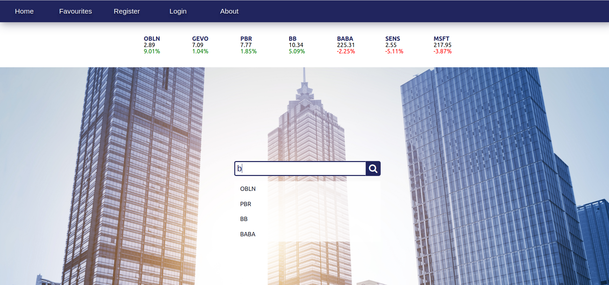
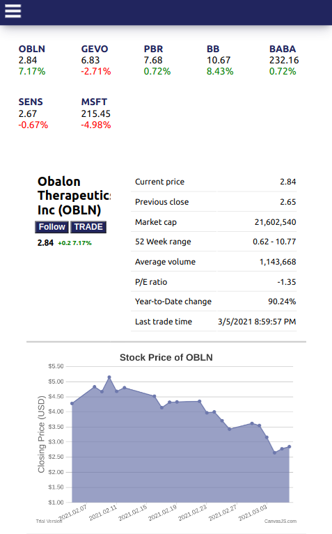
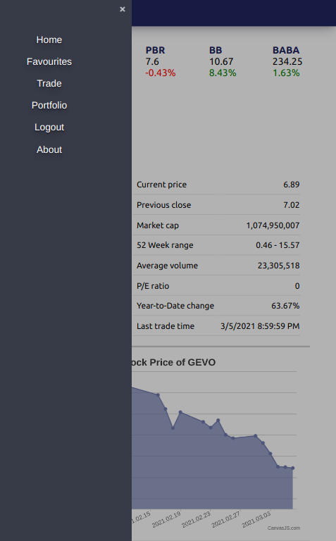

# OVERVIEW - stock exhange platform

This is a single page web application created in React. This repository contains the UI, all data presented on the site are retieved from our dedicated API.

Back-end repository is available here: https://github.com/dentman/stock-exchange-platform-backend.git

# HOW TO RUN

After cloning the repository, create a .env file based on the .env.template. If the backend server will not be running on http://localhost:8080, specify the required host and port in the REACT_APP_ORIGIN and REACT_APP_WEBSOCKET_ROUTE properties.

<pre><code>
cd stock_exchange_platform
npm install
npm start
</code></pre>

The React server will start at: http://localhost:3000

**DEPLOYMENT:**

The below command will create an optimized build of the app in the build folder.

<pre><code>npm run build</code></pre>

By renaming the build folder to 'public' and pasting it into the resources folder of the back-end application, the whole application can be deployed as one.

# MAIN FEATURES

The app is a news site for stock market news that also allows you to simulate trading.

## 1. News

**Home**

Access a certain stock's detailed page by looking for it in the search bar!

**Detailed View**

The detailed view contains information on the stock's price at previous market close, current price (simulated!), market cap, 52 week range, average volume, year to date change, and last trade time. There is also a graph showing stock prices for the last 30 days. Below, there are news related to the stock: a short video and excerpts from various articles from the last days.

**Favourites**

You can add stocks to the favourites, so you can have a quick overview of your favourite stocks' main statistics or easily access their detailed page. This feature does not require being a registered user of the site, but the content of your Favourites page will be limited to the browser you are using.

_Note that historical prices shown on diagrams are valid data retrieved from the IEXCloud API. Intraday changes in stock prices are, however, simulated!_

## 2. Trading

To be able to simulate trading you need to **register** to the site and log in. Upon registration you will receive a mock account with 10 000 USD.

**Trade**

You can buy or sell stock on the Trade page by specifying the symbol, the action (buy/sell), the amount and the limit price for the transaction. When clicking Trade, a confirmation dialog is shown with the details of the order you are about to place. The order is only finalized when confirming the placement. If, for some reason, the transaction could not be made (insufficient funds or owned stock, mismatch between current stock price and the limit price) a modal window will notify you about the error. Upon making a successful transaction, you will be redirected to the portfolio page.

**Portfolio**

On the Portfolio link you will find information about your account (username, current balance, and current total worth of your portfolio). Also, you will see the details of your portfolio, specifying the amount you own of each stock. Clicking on the History button, you can access the full transaction history for a given stock.

# LAYOUT

### Responsive design

  
